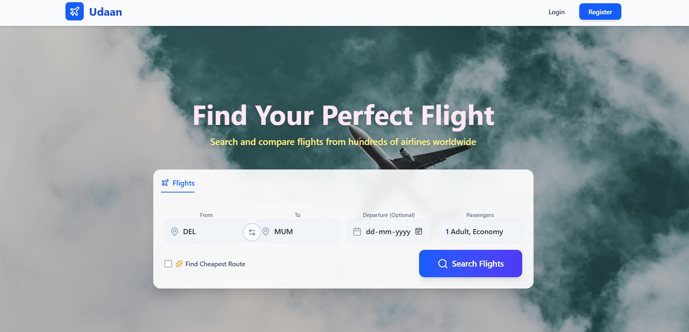

# Udaan - Full-Stack Flight Booking Platform

**Live Demo:** [https://udaan-frontend-mocha.vercel.app/](https://udaan-frontend-mocha.vercel.app/)


## 📖 Overview

Udaan is a complete, full-stack flight booking application built with the MERN stack. It provides a seamless user experience for searching, finding, and booking flights. The standout feature is the "Smart Route" functionality, which leverages Dijkstra's algorithm to find the cheapest multi-stop flight path, demonstrating a strong application of computer science fundamentals in a real-world scenario. The application also features real-time seat availability updates using Socket.IO to prevent double-bookings.

This project was built as a comprehensive portfolio piece to showcase skills in both frontend and backend development, API design, real-time communication, and algorithmic problem-solving.

## ✨ Features

- **User Authentication:** Secure user registration and login using JWT (JSON Web Tokens).
- **Flight Search:** Users can search for direct flights based on source, destination, and date.
- **Smart Route Finder:** An advanced search option that uses **Dijkstra's algorithm** to find the cheapest connecting flight route.
- **Real-Time Seat Selection:** A visual seat map for each flight, with real-time updates via **Socket.IO** to show booked seats instantly to all users.
- **Booking Management:** Logged-in users can book flights and view their booking history on a dedicated "My Bookings" page.
- **Fully Responsive UI:** A modern and intuitive user interface built with React and Tailwind CSS, ensuring a great experience on both desktop and mobile devices.

## 🛠️ Tech Stack

**Frontend:**
- React.js
- React Router
- Tailwind CSS
- Axios
- Socket.io-client
- Lucide React (for icons)

**Backend:**
- Node.js
- Express.js
- MongoDB with Mongoose
- JSON Web Token (JWT) for authentication
- Socket.IO
- bcryptjs for password hashing

## 🚀 Getting Started

To get a local copy up and running, follow these simple steps.

### Prerequisites

- Node.js installed on your machine
- npm or yarn
- A MongoDB Atlas account (or a local MongoDB instance)

### Installation & Setup

1.  **Clone the repository:**
    ```sh
    git clone [https://github.com/your-username/udaan.git](https://github.com/your-username/udaan.git)
    cd udaan
    ```

2.  **Backend Setup:**
    ```sh
    cd backend
    npm install
    ```
    Create a `.env` file in the `backend` directory and add the following environment variables:
    ```env
    MONGO_URI=your_mongodb_connection_string
    JWT_SECRET=your_jwt_secret
    PORT=5000
    ```
    Populate the database with the sample flight data:
    ```sh
    npm run seed
    ```
    Start the backend server:
    ```sh
    npm run dev
    ```

3.  **Frontend Setup:**
    Open a new terminal window.
    ```sh
    cd frontend
    npm install
    ```
    Create a `.env.local` file in the `frontend` directory to proxy API requests to your backend:
    ```env
    VITE_API_URL=http://localhost:5000
    ```
    Start the frontend development server:
    ```sh
    npm run dev
    ```

Your application should now be running locally at `http://localhost:5173`.
